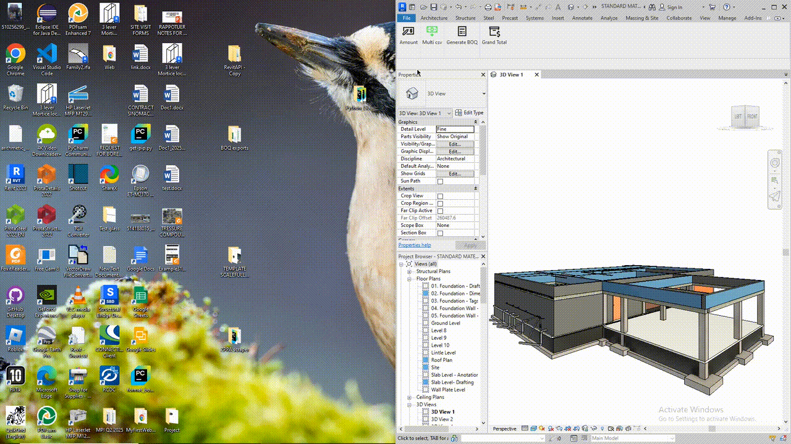

# 📊 pyRevit Cost Estimates Extension

Automate quantity takeoffs and cost estimation inside Autodesk Revit with **pyRevit**.  
This extension reduces manual work by directly populating costs, generating Bills of Quantities (BOQs), and calculating totals from your model.

---

## ✨ Features

- **Amount Population**: Automatically populate unit cost parameters (e.g., `Test_1234`) based on category.  
- **Generate BOQ**: Export structured cost breakdowns to Excel.  
- **Grand Total**: Summarize costs across all categories.  
- **Update Family Cost**: Sync family cost data using a CSV-based material pricing database.  

---

## 📊 Demonstration

Here’s a quick preview of the extension in action:



For higher clarity, [watch the full MP4 demo](assets/PyCostEstimate%20Demo%20video.mp4).  
Or click below to open it in a new tab:

<a href="assets/PyCostEstimate%20Demo%20video.mp4" target="_blank">▶ Watch Full MP4 Demo</a>

---

## ⚙️ Installation

Clone this repo and add it as a pyRevit extension:

```bash
pyrevit extend clone costestimates https://github.com/SwanaWJ/pyrevit-CostEstimates.git
pyrevit extensions reload
